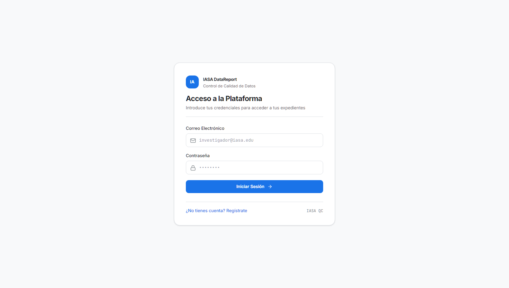
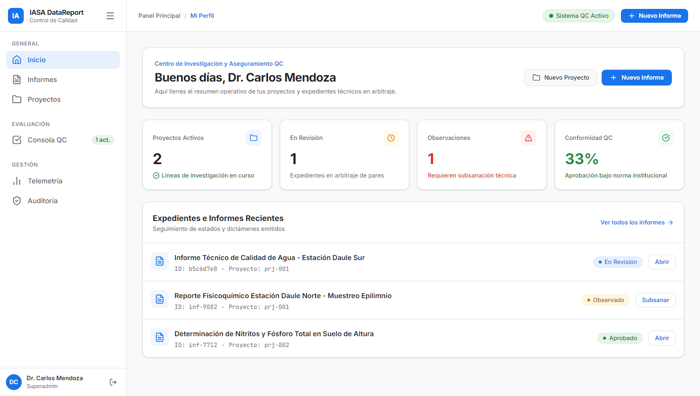
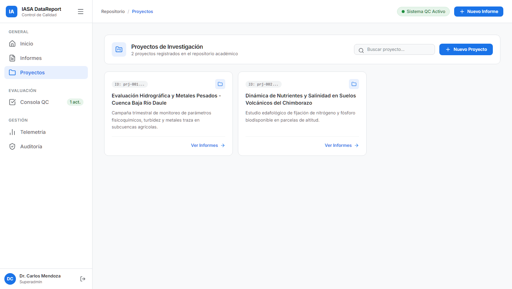
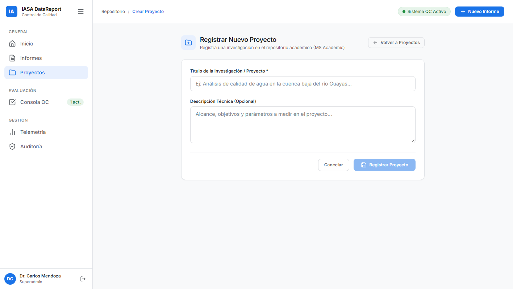
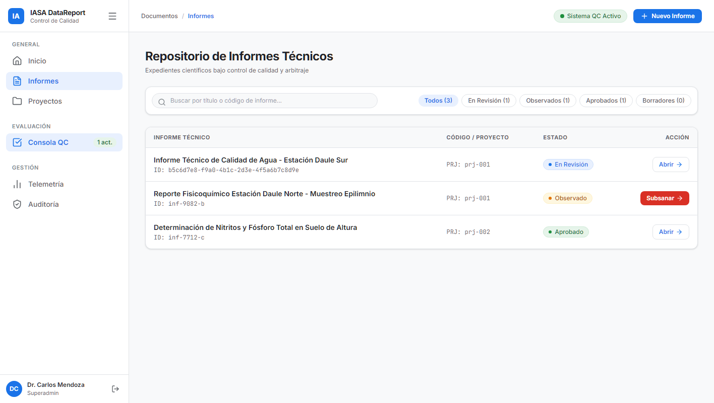
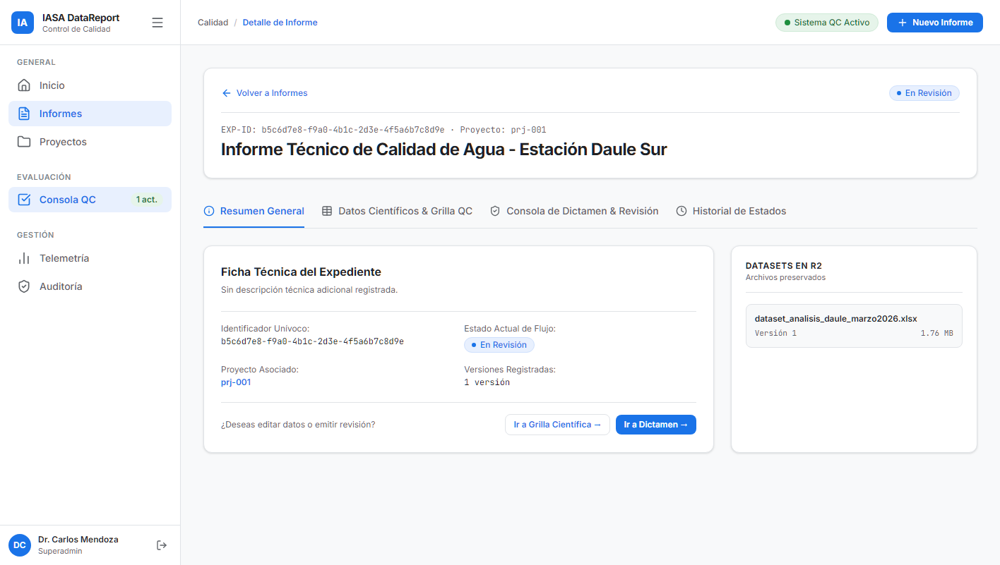
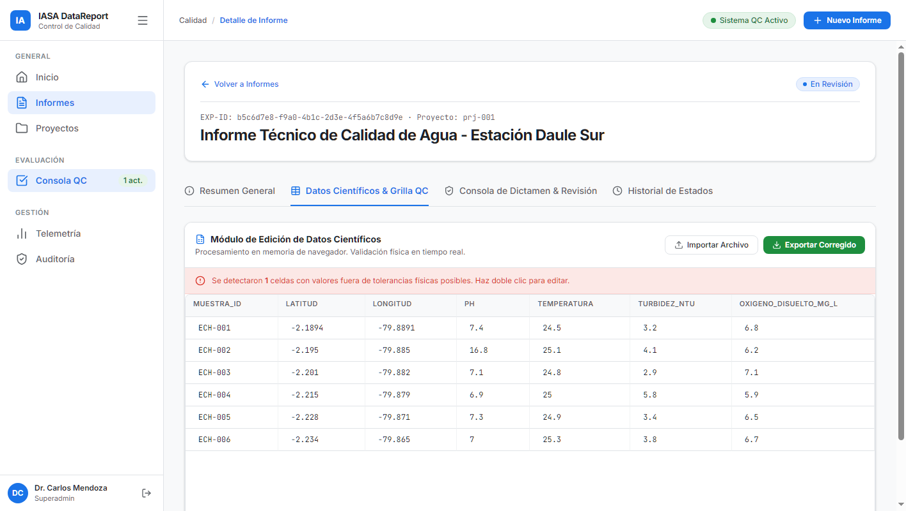
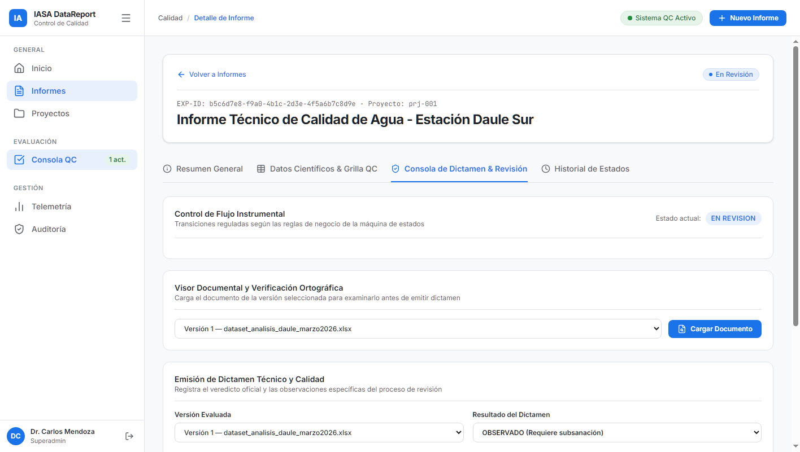
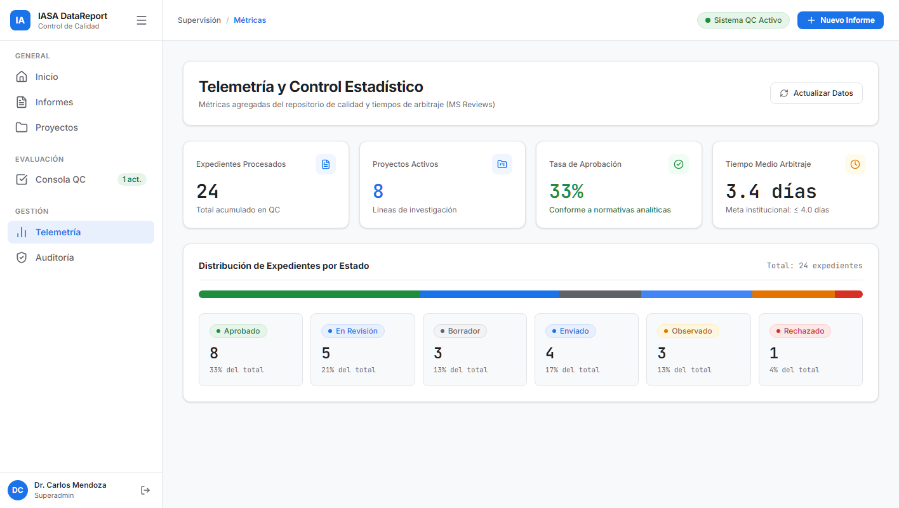
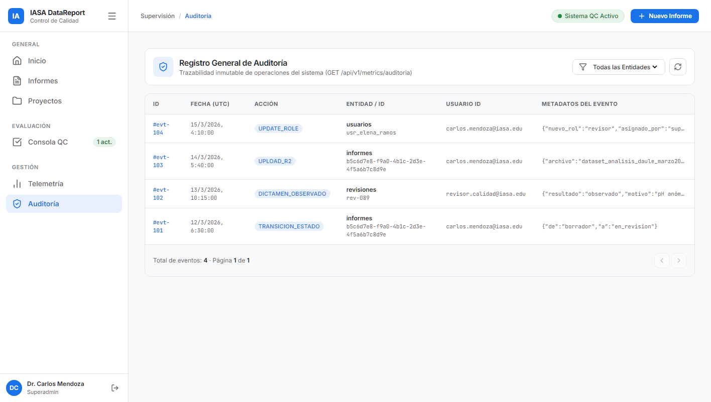

# Ciclo de Trabajo Integral — IASA DataReport (Frontend)

Este documento detalla la **arquitectura, diseño visual y ciclo operativo completo** de la plataforma de control de calidad de datos científicos **IASA DataReport**, ilustrado paso a paso con capturas de pantalla de la interfaz rediseñada inspirada en los estándares de **Google Workspace** y **Google Cloud Console**.

---

## 1. Principios de Diseño UX/UI (Google Workspace & Cloud Console)

El frontend fue completamente modernizado en su capa visual manteniendo **100% intacta la lógica técnica de microservicios, contratos de API, autenticación y máquinas de estado**:

- **Cero Emojis**: Toda la iconografía se basa exclusivamente en íconos SVG vectoriales limpios y minimalistas (Lucide React stroke).
- **Sin Módulos Enumerados**: Eliminada toda numeración rígida en menús y títulos (ej. *Proyectos*, *Informes*, *Métricas*, en lugar de *1. Inicio*, *2. Proyectos*).
- **Tipografía Institucional**:
  - `font-sans`: **Inter** para títulos, etiquetas, formularios y texto de lectura.
  - `font-mono`: **JetBrains Mono** para identificadores UUID, métricas numéricas, timestamps y celdas de datos científicos.
- **Paleta de Colores Google Cloud**:
  - Fondo base: `#F8F9FA` (blanco frío / gris muy suave).
  - Tarjetas y contenedores: `#FFFFFF` con sutil borde `#E0E3E7` y sombra Google (`box-shadow: 0 1px 2px 0 rgba(60,64,67,0.3), 0 1px 3px 1px rgba(60,64,67,0.15)`).
  - Tinta de texto: `#202124` (`text-ink`) con alto contraste para legibilidad.
  - Tinta secundaria: `#5F6368` (`text-ink-muted`) para metadatos y subtítulos.
  - Acento primario: `#1A73E8` (Google Blue) con variantes hover `#1557B0`.
  - Píldoras de Estado (Chips Google):
    - **Borrador / Recibido**: Fondo `#F1F3F4`, texto `#3C4043`, punto `#5F6368`.
    - **En Revisión**: Fondo `#E8F0FE`, texto `#1A73E8`, punto `#1A73E8`.
    - **Observado**: Fondo `#FEF7E0`, texto `#B06000`, punto `#F2994A`.
    - **Aprobado**: Fondo `#E6F4EA`, texto `#137333`, punto `#1E8E3E`.
    - **Rechazado**: Fondo `#FCE8E6`, texto `#C5221F`, punto `#D93025`.
- **Navegación Intuitiva**:
  - **Sidebar Lateral Colapsable**: Con botón toggle hamburguesa, agrupado en secciones limpias (*General*, *Académico*, *Supervisión*, *Configuración*) y tarjeta de perfil de usuario.
  - **Topbar Superior**: Con migas de pan dinámicas (*Breadcrumbs*), buscador global y botón de acción rápida `+ Nuevo Informe`.
  - **Espacio de Trabajo por Pestañas**: En la vista de detalle de informes, la pestaña por defecto es **Resumen General**, seguida de *Datos Científicos & Grilla QC*, *Consola de Dictamen & Revisión*, *Documento & Lenguaje* e *Historial de Estados*.

---

## 2. Arquitectura Técnica y Microservicios

- **Despliegue**: SPA Estática (`output: 'static'`) alojada en **Cloudflare Pages**.
- **Gestión de Sesión**: 100% en cliente (`localStorage`), aislada por rutas con `<AuthGuard />`.
- **Ecosistema Backend**:
  1. `ms-auth` (Puerto 8787): Registro, login JWT, perfiles y roles (`SUPERADMIN`, `INVESTIGADOR`, `REVISOR`).
  2. `ms-academic` (Puerto 8788): Proyectos científicos, expedientes de informes y transiciones de estado PostgreSQL.
  3. `ms-reviews` (Puerto 8789): Dictámenes técnicos de revisión, telemetría agregada y registro de auditoría inmutable.
  4. `ms-storage` (Puerto 8790): Preservación binaria de datasets y anexos en Cloudflare R2 Storage.
  5. *Servicio Externo*: **LanguageTool** para auditoría léxica y ortográfica.

---

## 3. Ciclo de Trabajo Paso a Paso

### 3.1 Fase 1: Acceso y Control de Sesión (`/login`)
El usuario ingresa al portal mediante el formulario de autenticación institucional. El diseño Google Card presenta campos limpios con validación interactiva, botón de acción primario `#1A73E8` e indicadores de carga. Al autenticar, almacena el token JWT y los datos de perfil en el cliente.



---

### 3.2 Fase 2: Centro de Actividad e Identidad (`/inicio`)
Al ingresar, el usuario es recibido por el Activity Hub de Google Workspace, que presenta:
- Tarjeta de credencial activa con avatar institucional, correo y chip de rol (`SUPERADMIN`, `INVESTIGADOR` o `REVISOR`).
- 4 tarjetas de métricas analíticas (Proyectos Activos, Informes en Revisión, Tasa de Aprobación y Acciones Auditadas).
- Enlaces rápidos de navegación directa a las funciones principales.



---

### 3.3 Fase 3: Gestión de Proyectos de Investigación (`/proyectos`)
Catálogo de líneas científicas activas gestionadas por `ms-academic`. Cada tarjeta de proyecto despliega su título, fecha de creación, código identificador y botón para explorar expedientes técnicos asociados.



---

### 3.4 Fase 4: Registro de Nuevo Proyecto (`/proyectos/nuevo`)
Formulario asistido con tipografía Inter para dar de alta una nueva investigación científica mediante `POST /api/v1/proyectos`, definiendo el título y alcance técnico del proyecto.



---

### 3.5 Fase 5: Repositorio General de Informes (`/informes`)
Repositorio central de expedientes con sistema de filtrado mediante **píldoras interactivas estilo Google**:
- Filtros rápidos: `Todos`, `En Revisión`, `Observados`, `Aprobados`, `Borradores`.
- Buscador reactivo por título, proyecto o identificador.
- Tabla estilizada con tipografía monoespaciada para códigos UUID y chips de estado de alto contraste.



---

### 3.6 Fase 6: Espacio de Trabajo — Resumen General (`/informes/detalle?id=...`)
La vista principal de control de calidad abre por defecto en la pestaña **Resumen General**:
- **Tarjeta de Metadatos**: Identificador unívoco, proyecto vinculado, fecha de creación y estado actual.
- **Dataset Principal en Cloudflare R2**: Detalle del archivo de datos cargado (`.xlsx`, `.csv`), tamaño y botón de descarga directa.
- **Barra de Acciones Rápidas**: Accesos directos a la emisión de dictamen y carga de nuevas versiones.



---

### 3.7 Fase 7: Control de Calidad de Datos Científicos — Grilla Interactiva
Pestaña **Datos Científicos & Grilla QC**:
- **Procesamiento en Cliente**: Carga y procesa archivos `.xlsx` y `.csv` usando `xlsx` y `react-data-grid` sin saturar la red ni la base de datos.
- **Detección Automática de Anomalías Físicas**: Algoritmo en tiempo real que evalúa rangos científicos admisibles (ej. $\text{pH} \in [0, 14]$, Latitud $\in [-90, 90]$, Longitud $\in [-180, 180]$).
- **Banner de Alerta Instrumental**: Identifica el número de anomalías y resalta las celdas con discrepancias físicas.
- **Edición en Vivo y Exportación**: Los revisores pueden corregir las celdas directamente con doble clic y exportar el archivo subsanado con el botón **Exportar Corregido**.



---

### 3.8 Fase 8: Consola de Dictamen y Transiciones de Estado
Pestaña **Consola de Dictamen & Revisión**:
- **Transiciones de la Máquina de Estados**: Botones de acción contextuales según el estado actual del informe (`Enviar a Revisión`, `Aprobar Informe`, `Registrar Observaciones`, `Rechazar Informe`).
- **Formulario de Dictamen Técnico**: Campo para veredicto y redacción de observaciones puntuales enviadas a `ms-reviews`.



---

### 3.9 Fase 9: Telemetría y Supervisión Analítica (`/admin/dashboard`)
Panel de monitoreo estilo Google Cloud Logging/Monitoring alimentado por `GET /api/v1/metrics/dashboard`:
- 4 tarjetas KPI de alto nivel con porcentajes de cambio.
- Barra de progreso segmentada horizontal para visualizar la distribución visual de expedientes.
- Cuadrícula de desglose cuantitativo por cada estado del Enum instrumental.



---

### 3.10 Fase 10: Trazabilidad y Auditoría Inmutable (`/admin/auditoria`)
Bitácora de seguridad alimentada por `GET /api/v1/metrics/auditoria`:
- Filtros por tipo de entidad (`ALL`, `INFORME`, `PROYECTO`, `USUARIO`).
- Tabla de eventos con marca de tiempo UTC, tipo de acción (`TRANSICION_ESTADO`, `UPLOAD_R2`, etc.), usuario responsable y visor de metadatos JSON formateados con tipografía monoespaciada.
- Paginación dinámica de registros.



---

## 4. Comandos de Operación y Desarrollo

### Servidor Local en Producción Estática:
```bash
# Compilar bundles estáticos
npm run build

# Iniciar servidor estático local (puerto 4321)
node serve.cjs
```

### URLs de Acceso Local:
- Acceso: `http://127.0.0.1:4321/login`
- Inicio: `http://127.0.0.1:4321/inicio`
- Proyectos: `http://127.0.0.1:4321/proyectos`
- Informes: `http://127.0.0.1:4321/informes`
- Expediente QC: `http://127.0.0.1:4321/informes/detalle?id=b5c6d7e8-f9a0-4b1c-2d3e-4f5a6b7c8d9e`
- Métricas: `http://127.0.0.1:4321/admin/dashboard`
- Auditoría: `http://127.0.0.1:4321/admin/auditoria`
